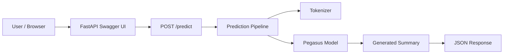
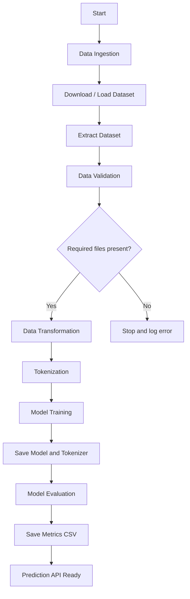
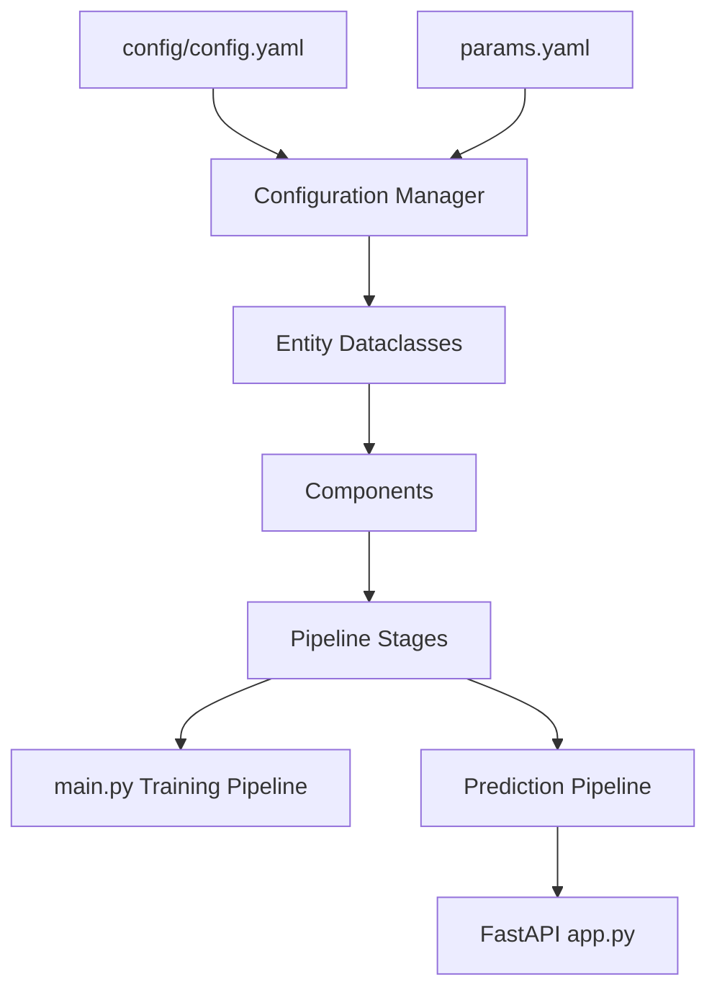
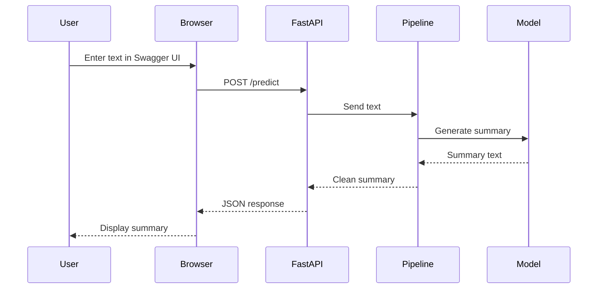
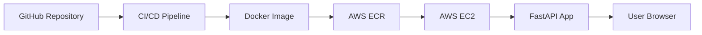
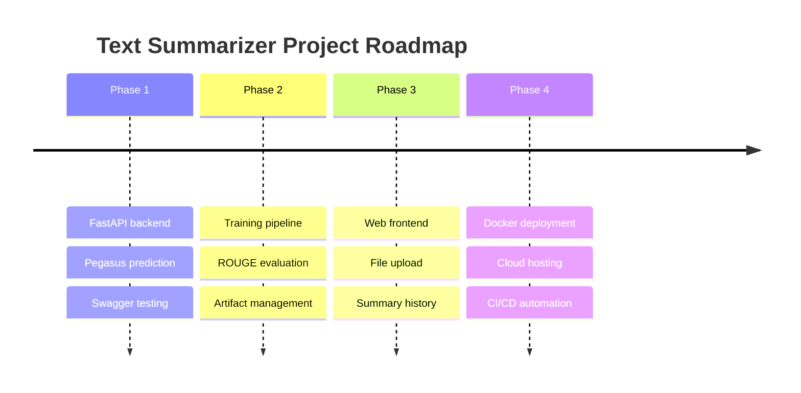

# 🧠 Text Summarization NLP Project

> **An End-to-End NLP Text Summarization System built with FastAPI, Hugging Face Transformers, Pegasus, PyTorch, Datasets, and a modular Machine Learning pipeline.**

---

# 📑 Table of Contents

- [📖 Overview](#-overview)
- [🎯 Project Goals](#-project-goals)
- [✨ Features](#-features)
- [🛠 Tech Stack](#-tech-stack)
- [⭐ Highlights](#-highlights)
- [🏗 System Architecture](#-system-architecture)
- [🔄 ML Pipeline Workflow](#-ml-pipeline-workflow)
- [🧩 Component Architecture](#-component-architecture)
- [📁 Project Structure](#-project-structure)
- [⚙ Configuration Files](#-configuration-files)
- [🌐 REST API](#-rest-api)
- [📥 Input and Output Format](#-input-and-output-format)
- [💻 Installation](#-installation)
- [🚀 Run the Application](#-run-the-application)
- [🧪 Testing and Verification](#-testing-and-verification)
- [🏋️ Model Training](#️-model-training)
- [📊 Model Evaluation](#-model-evaluation)
- [🐳 Docker Support](#-docker-support)
- [☁ Deployment Notes](#-deployment-notes)
- [🛠 Troubleshooting](#-troubleshooting)
- [🔮 Future Improvements](#-future-improvements)
- [🗺 Roadmap](#-roadmap)
- [📄 License](#-license)
- [🙏 Acknowledgements](#-acknowledgements)
- [👨‍💻 Author](#-author)

---

# 📖 Overview

The **Text Summarization NLP Project** is a complete machine learning application that summarizes long text, dialogue, or conversational content into concise summaries. It follows a professional end-to-end ML workflow with separate stages for data ingestion, validation, transformation, model training, evaluation, and prediction.

The project exposes a **FastAPI REST API** where users submit text and receive a generated summary. The summarization engine uses **Google Pegasus**, a transformer-based sequence-to-sequence model designed for abstractive summarization.

This project is useful for:

- summarizing articles
- summarizing conversations
- summarizing support chats
- reducing large text into key points
- learning end-to-end NLP project structure
- understanding ML model deployment with FastAPI

---

# 🎯 Project Goals

- Build a complete NLP project from raw data to API prediction.
- Use transformer-based summarization with Hugging Face.
- Train and evaluate on the SAMSum dialogue summarization dataset.
- Serve predictions through a clean FastAPI backend.
- Keep the code modular, configurable, and production-friendly.
- Provide Windows-friendly execution using `run_app.bat`.
- Support local model artifacts and Hugging Face cached fallback models.

---

# ✨ Features

## 📝 Text Summarization

- Abstractive summarization
- Dialogue summarization
- Long text summarization
- Pegasus model support
- Clean JSON API response

## ⚡ FastAPI Backend

- Interactive Swagger UI
- REST API prediction endpoint
- Automatic OpenAPI documentation
- Request and response validation using Pydantic

## 🧠 ML Pipeline

- Data ingestion
- Data validation
- Data transformation
- Model training
- Model evaluation
- Prediction pipeline

## 📦 Config-Driven Design

- Central `config.yaml`
- Central `params.yaml`
- Dataclass-based entities
- Reusable configuration manager

## 💻 Windows Friendly

- `run_app.bat` launcher
- VS Code terminal support
- Browser-based testing through Swagger UI
- Local `.venv` workflow

## 🔁 Offline-Friendly Prediction

- Uses trained artifacts when available
- Falls back to local Hugging Face cache
- Avoids unnecessary online lookup when cached model files exist

---

# 🛠 Tech Stack

## 🧪 Machine Learning and NLP

- Python
- PyTorch
- Hugging Face Transformers
- Hugging Face Datasets
- Google Pegasus
- SentencePiece
- Evaluate
- ROUGE Score
- SacreBLEU

## 🌐 Backend

- FastAPI
- Uvicorn
- Pydantic
- Starlette

## 📊 Data Processing

- Pandas
- PyYAML
- Python Box
- TQDM
- py7zr

## ⚙ Engineering Tools

- Modular Python package
- Config-driven pipeline
- Editable installation using `setup.py`
- Windows batch launcher
- Dockerfile support

---

# ⭐ Highlights

- 🧠 Transformer-based summarization
- ⚡ FastAPI REST API
- 📚 SAMSum dataset pipeline
- 🧩 Modular ML architecture
- 🔧 Configurable training parameters
- 📊 ROUGE evaluation
- 💻 VS Code and browser-friendly execution
- 🪟 Windows `run_app.bat` support
- 🔁 Local model fallback support

---

# 🏗 System Architecture



---

# 🔄 ML Pipeline Workflow



---

# 🧩 Component Architecture



---

# 📡 API Request Flow



---

# 📁 Project Structure

```text
Text-Summarization-NLP-Project-main/
├── .github/
├── artifacts/
│   ├── data_ingestion/
│   ├── data_validation/
│   ├── data_transformation/
│   ├── model_trainer/
│   └── model_evaluation/
├── config/
│   └── config.yaml
├── research/
│   ├── 01_data_ingestion.ipynb
│   ├── 02_data_validation.ipynb
│   ├── 03_data_transformation.ipynb
│   ├── 04_model_trainer.ipynb
│   ├── 05_Model_evaluation.ipynb
│   └── Text_Summarization.ipynb
├── src/
│   └── textSummarizer/
│       ├── config/
│       ├── constants/
│       ├── conponents/
│       ├── entity/
│       ├── logging/
│       ├── pipeline/
│       └── utils/
├── app.py
├── main.py
├── params.yaml
├── requirements.txt
├── run_app.bat
├── setup.py
├── Dockerfile
├── RUN_INSTRUCTIONS.txt
└── README.md
```

> Note: The source folder is named `conponents` in the existing project code. The spelling is preserved for compatibility.

---

# ⚙ Configuration Files

## `config/config.yaml`

Controls artifact paths, dataset URL, tokenizer, model checkpoint, and evaluation output.

```yaml
artifacts_root: artifacts

data_ingestion:
  root_dir: artifacts/data_ingestion
  source_URL: https://github.com/entbappy/Branching-tutorial/raw/master/summarizer-data.zip
  local_data_file: artifacts/data_ingestion/data.zip
  unzip_dir: artifacts/data_ingestion

model_trainer:
  root_dir: artifacts/model_trainer
  data_path: artifacts/data_transformation/samsum_dataset
  model_ckpt: google/pegasus-cnn_dailymail

model_evaluation:
  root_dir: artifacts/model_evaluation
  model_path: artifacts/model_trainer/pegasus-samsum-model
  tokenizer_path: artifacts/model_trainer/tokenizer
```

## `params.yaml`

Stores training hyperparameters.

```yaml
TrainingArguments:
  num_train_epochs: 1
  warmup_steps: 500
  per_device_train_batch_size: 1
  weight_decay: 0.01
  logging_steps: 10
  evaluation_strategy: steps
  eval_steps: 500
  save_steps: 1e6
  gradient_accumulation_steps: 16
```

---

# 🌐 REST API

## Base URL

```text
http://127.0.0.1:8000
```

## Swagger UI

```text
http://127.0.0.1:8000/docs
```

## Endpoints

| Method | Endpoint | Description |
|---|---|---|
| GET | `/` | Redirects to Swagger UI |
| GET | `/train` | Runs complete training pipeline |
| POST | `/predict` | Generates summary for input text |

---

# 📥 Input and Output Format

## POST `/predict`

### Request Body

```json
{
  "text": "Artificial intelligence is changing how people work, learn, and communicate. Text summarization helps convert long documents into short and meaningful summaries."
}
```

### Response Body

```json
{
  "summary": "Artificial intelligence is changing how people work, learn, and communicate."
}
```

---

# 💻 Installation

## Prerequisites

- Python 3.10 or 3.11
- VS Code
- Git
- Chrome, Edge, or Firefox
- Internet connection for first dependency installation

---

# 🚀 Run the Application

## Option 1: VS Code + Browser

1. Open **VS Code**.
2. Click **File > Open Folder**.
3. Select the project folder.
4. Open terminal: **Terminal > New Terminal**.
5. Run:

```powershell
.\run_app.bat
```

6. Keep the terminal open.
7. Open browser:

```text
http://127.0.0.1:8000/docs
```

8. Open `POST /predict`.
9. Click **Try it out**.
10. Paste JSON input.
11. Click **Execute**.

## Option 2: Manual Setup

```bash
python -m venv .venv
```

### Activate on Windows PowerShell

```powershell
.\.venv\Scripts\Activate.ps1
```

### Install Dependencies

```bash
pip install --upgrade pip
pip install -r requirements.txt
```

### Start Server

```bash
python app.py
```

---

# 🧪 Testing and Verification

## Compile Source Code

```bash
python -m compileall app.py main.py src
```

## Test Direct Prediction

```bash
python verify_predict.py
```

## Test API in Browser

```text
http://127.0.0.1:8000/docs
```

---

# 🏋️ Model Training

Run the full training pipeline:

```bash
python main.py
```

Or from API:

```text
GET /train
```

Training stages:

1. Data ingestion
2. Data validation
3. Data transformation
4. Model training
5. Model evaluation

> Training Pegasus on CPU can be very slow. GPU is recommended.

---

# 📊 Model Evaluation

Evaluation output:

```text
artifacts/model_evaluation/metrics.csv
```

Metrics:

- ROUGE-1
- ROUGE-2
- ROUGE-L
- ROUGE-Lsum

---

# 🐳 Docker Support

Build image:

```bash
docker build -t text-summarizer .
```

Run container:

```bash
docker run -p 8000:8000 text-summarizer
```

---

# ☁ Deployment Notes

Possible platforms:

- AWS EC2
- AWS ECR
- Render
- Railway
- Azure App Service
- Google Cloud Run
- Docker VPS



---

# 🛠 Troubleshooting

## Port Already in Use

Change the port in `app.py`:

```python
uvicorn.run("app:app", host="127.0.0.1", port=8001)
```

## First Prediction Is Slow

Pegasus is a large model. First prediction loads the model into memory.

## Model Artifacts Missing

The app checks:

1. `artifacts/model_trainer/pegasus-samsum-model`
2. `artifacts/model_trainer/tokenizer`
3. local Hugging Face cache for `google/pegasus-cnn_dailymail`

## Dependency Installation Fails

```bash
python -m pip install --upgrade pip setuptools wheel
pip install -r requirements.txt
```

## PowerShell Script Blocked

```powershell
Set-ExecutionPolicy -ExecutionPolicy RemoteSigned -Scope CurrentUser
```

Or run `run_app.bat` from Command Prompt.

---

# 🔮 Future Improvements

- React frontend
- Streamlit frontend
- PDF summarization
- URL/article summarization
- File upload support
- Multilingual summarization
- Summary history
- Authentication
- Database storage
- GPU/CPU runtime indicator
- Docker Compose
- Automated tests
- CI/CD pipeline
- Cloud deployment

---

# 🗺 Roadmap



---

# 📄 License

This project is prepared for educational and portfolio use. Add your preferred license before publishing publicly.

---

# 🙏 Acknowledgements

- Hugging Face
- PyTorch
- FastAPI
- Google Pegasus
- SAMSum Dataset
- ROUGE Score
- Python Open Source Community

---

# 👨‍💻 Author

**Ravi Kumar Sharma**

- B.Tech CSE Student
- NLP and Full Stack Development Enthusiast
- Python, Machine Learning, and Web Development Learner

---

# 🌟 Final Note

This project demonstrates how a machine learning model can be converted into a practical API-based application. It combines NLP, transformer models, backend engineering, modular project structure, and deployment-ready design into one complete text summarization system.
